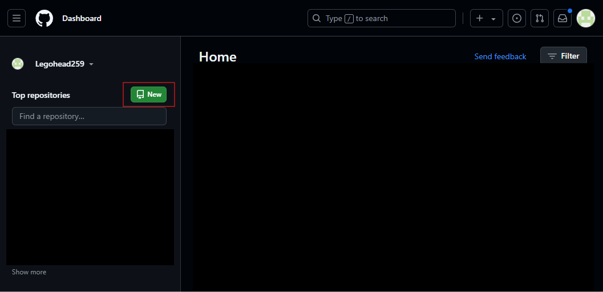
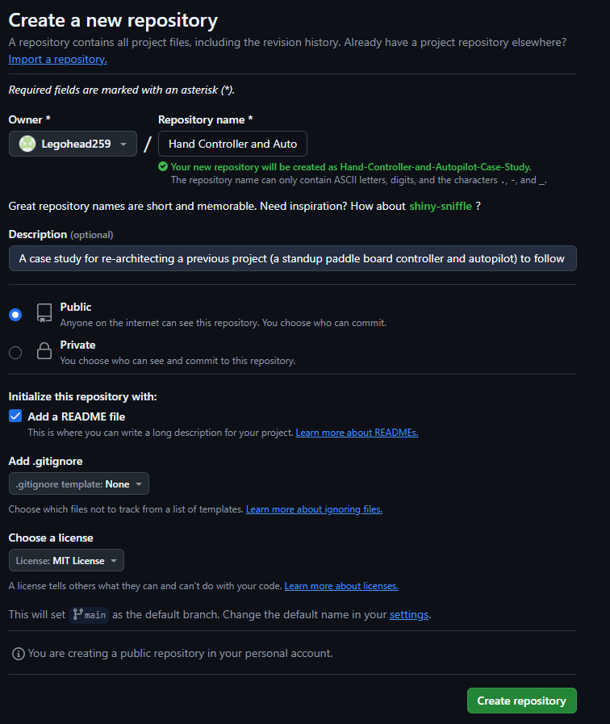
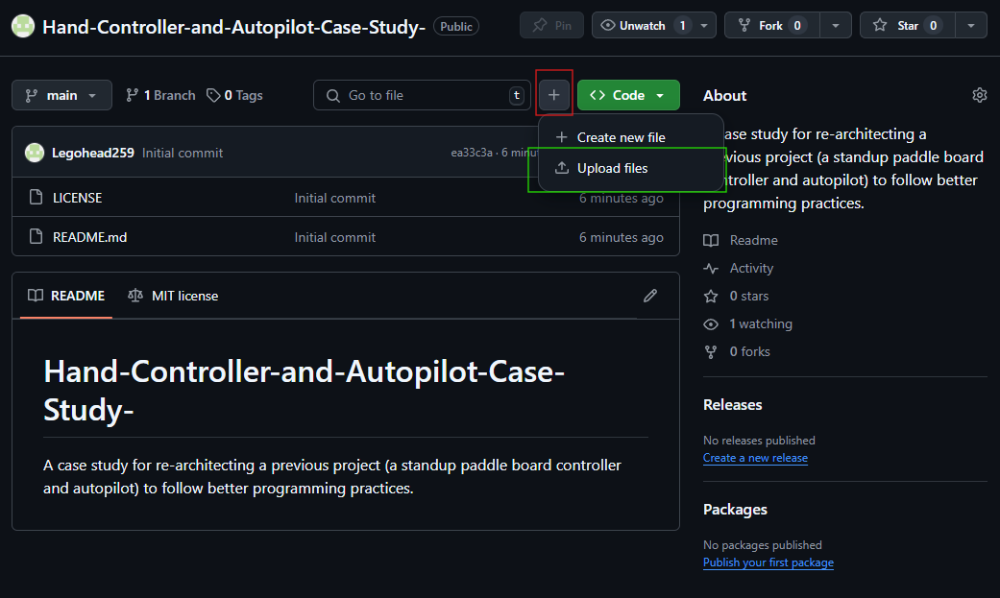
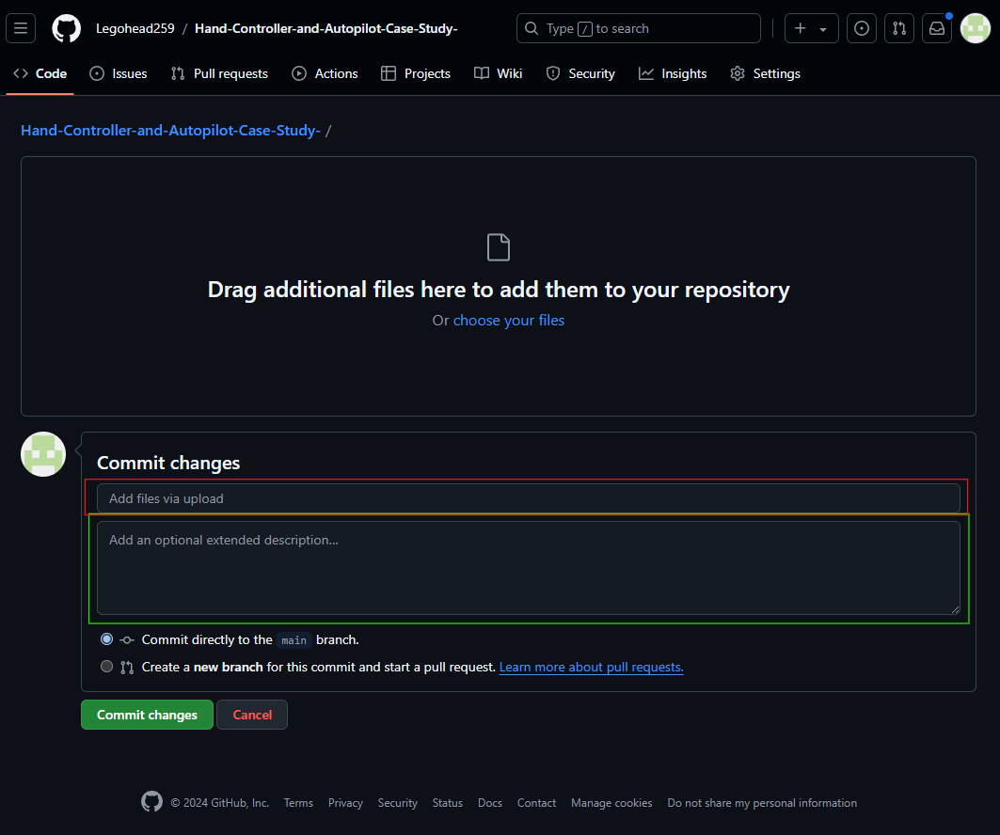

# GitHub Get Started

One of the most important tasks with any software engineering project (yes, you are engineering software, no matter how simple you think it is!) is to use a version control software (VCS).
A VCS will take snapshots of your code, called `commits`, and save a history of them so you can roll back or track changes in your code through the development cycle.
You can do this locally using `git` or `svn`, but both protocols support remote backup repositories which are *highly* recommended in case your local storage solution fails.

For simplicity, we shall use `git` and `GitHub.com` for VCS since those are the most popular and well supported and free.

## Install Git

Install git using the guide found [here](https://git-scm.com/book/en/v2/Getting-Started-Installing-Git). Just follow the section for your specific operating system and don't think too hard about it.
Follow the prompts from the installer.
You will be fine using defaults for all the different configuration options.

## Using GitHub

Create or log into your account on [GitHub](https://github.com).
On the left-hand panel, select the green "New" button to create a new repository.

Now, fill in the information for the new repository.
The name should be short and memorable.
A description can help you remember later roughly what you were trying to accomplish.
It doesn't matter if the repository is public or private, but public repositories can be more easily added to engineering portfolios for job interviews or websites.
Make sure to initialize with a README file that will be the starting point for your documentation.
And then choose a license: the MIT is a good general Free, Open Source Software (FOSS) license, but consider carefully if you intend to monetize this software or share widely.

If you already have code files, we can use the GitHub UI to upload them and create our first commit.
Select the "Add File" button (red box) next to the green "<> Code" button and select "Upload files" (green box).

Choose your files on the next screen and update the information in the commit changes box.
The top bar (red box) is the commit title; it should be short, but get across the gist of what this commit accomplishes.
The larger box below (green box) is an extended description where you can add more relevant details.
When finished, click the green "Commit changes" button to push the files to the repository automatically.
For now, we are fine committing to the main branch, though we will want to do more later when we get more advanced.

