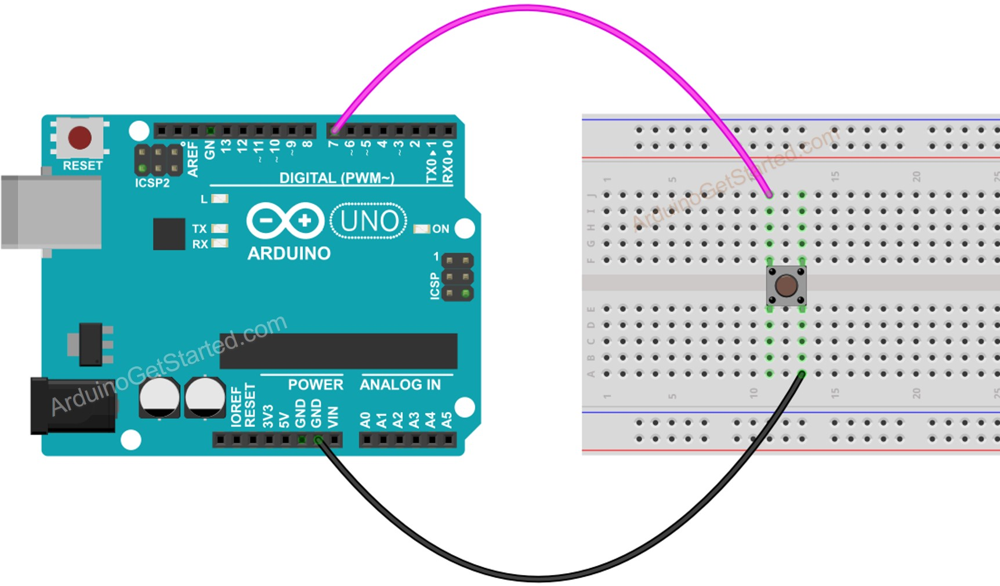

# Software Debounce

## Original Code

```cpp
//Loiter
  int reading = digitalRead(2);
  
  if (reading != lastButtonState_Loiter) {
    lastDebounceTime_Loiter = millis();
  }
  if ((millis() - lastDebounceTime_Loiter) > debounceDelay_misc) {
    if (reading != buttonState_Loiter) {
      buttonState_Loiter = reading;
      if (buttonState_Loiter == LOW) {
        LoRa.beginPacket();
        LoRa.print("LT");
        LoRa.endPacket();
        Serial.println("Sending Loiter");
        //lock=!lock;
        //Serial.println("Locking down joystick");
      }
    }
  }
  lastButtonState_Loiter = reading;

  //Calibrate
  reading = digitalRead(4);
  if (reading != lastButtonState_C) {
    lastDebounceTime_C = millis();
  }
  if ((millis() - lastDebounceTime_C) > debounceDelay_misc) {
    if (reading != buttonState_C) {
      buttonState_C = reading;
      if (buttonState_C == LOW) {
        LoRa.beginPacket();
        LoRa.print("CC");
        LoRa.endPacket();
        Serial.println("Sending Calibration Request");
      }
    }
  }
  lastButtonState_C = reading;
```

## Problems

### Arithmetic Operations

In this code, for every loop, the debounce functionality is checked with 

```cpp
if ((millis() - lastDebounceTime_C) > debounceDelay_misc)
```

Which introduces a lot of operations per second that are unnecessary since we do not want to do the debouncing operation *unless* the button has been pressed.
The button pin is configured as an `INPUT_PULLUP` which means that we only care about the debounce when the button reading is `LOW`.
The following snippet does not perform the check *unless* the reading is `LOW` (`!reading`).

```cpp
if (!reading && (millis() - lastDebounceTime_C) > debounceDelay_misc)
```


### Best Practices

#### Constant Variables

Some variables are used as constants, but not denoted as such. In C++ (Arduino) it is considered best practice to put all constant variables in `UPPER_SNAKE_CASE` format so it is immediately apparent that they are constant.
They should also be declared in the top of the file as either the precompiler instruction, `#define`, or with the decorator, `const`.

E.g.

```cpp
unsigned long debounceDelay_misc = 50; // the debounce time; increase if the output
```

Would become either:

```cpp
#define DEBOUNCE_DELAY 50 // ms, used to mitigate noisy switch inputs in software, rather than use a hardware lowpass filter
```

or

```cpp
const unsigned long DEBOUNCE_DELAY 50 // ms, used to mitigate noisy switch inputs in software, rather than use a hardware lowpass filter
```

Both functionally do the same thing, but these variables become immutable (unable to be changed in runtime) which can prevent issues where they are inadvertently changed by a process.

#### Variable Naming Schema

In C++, the preferred naming schema is `camelCase` for variables and functions. In the original code, there is a mix of `camelCase` and `snake_case` in variable names which, while not fundamentally wrong, is bad practice.
We can rename the variables like so:

```cpp
unsigned long lastDebounceTimeLoiter = 0;  // the last time the output pin was toggled
unsigned long lastDebounceTimeLock = 0;
unsigned long lastDebounceTimeGU = 0;
unsigned long lastDebounceTimeGD = 0;
unsigned long lastDebounceTimeC = 0;
const unsigned long DEBOUNCE_DELAY = 50; // ms, used to mitigate noisy switch inputs in software, rather than use a hardware lowpass filter
int buttonStateLoiter; // the current reading from the input pin
int buttonStateLock;
int buttonStateGU;
int buttonStateGD;
int buttonStateC;
int lastButtonStateLoiter = HIGH;
int lastButtonStateLock = HIGH;
int lastButtonStateGU = HIGH;
int lastButtonStateGD = HIGH;
int lastButtonStateC = HIGH;
```

#### Repeats

In this code, there are several lines and variables that functionally do the same thing, but are repeated.
This is fine, but we can improve readability and functionality by encapsulating these variables into more distinct objects or functions.
By encapsulation, we also make expansion or changing easier since we do not have to copy/paste a fixed function or variable name multiple times, we just have to do it once.
Think if you want to expand to four buttons, instead of two, you now need twice the code and if you find a bug in the debounce code, you have to make the same change four times.
Conversely, if you want to flip-flop between having the buttons hardware versus software debounce (like what may happen when experimenting with a hardware prototype), then entire sections need to be commented out or removed.
Trust me, this will get annoying.
We can improve this using **encapsulation**.

What is a button? What do we want it to do?
A button is an object that the user presses and we want to perform an action after being debounced either in hardware or software.
Since the button is an object, it has properties like the `pin` its attached to, `currentState`, `lastTimePressed`, etc.
We can leverage the C++ `struct` construct to make a really simple button object that we can instantiate for however many buttons we have connected.
If we need to change something with the button behavior, we only need to modify the `struct` and not the same section of code over and over.

We can define a button structure like so:

```cpp
struct Button {
    // Settable properties
    uint8_t pin;
    bool swDebounce = true; // Toggle if the button uses internal software debounce or not. Default: true
    bool activeState = LOW; // The button state in which we want to activate the functionality. E.g. LOW if the button is configured as an active low. Default: LOW
    void (*callback)(); // The action we want the button the do as a function

    // Internal properties
    bool _reading;
    bool _currentState;
    bool _lastState;
    unsigned long _lastPressed; // ms
    unsigned long _debounceDelay; // ms

    bool _debounce() {
        if (_reading != _lastState) {
            _lastPressed = millis();
        }
        if (!_reading && (millis() - _lastPressed) > _debounceDelay) {
                if (_reading != _currentState) {
                    _currentState = _reading;
                if (_currentState == activeState) { // Supports activating callback for both active high and active low configurations.
                    return true;
                }
            }
        }
        return false;
    }

    void poll() {
        _reading = digitalRead(pin);
        if (swDebounce && !_debounce()) { // Enable and enact software debouncing
            _lastState = _reading; // Set last button state and exit
        }
        else if (_reading == activeState) { // If swDebounce is FALSE or the software debounce time has passed and the button is in the active state
            if (callback != nullptr) callback(); // execute the callback
            _lastState = _reading; // Set last button state and exit
        }
    }
};
```

Side note on semantics: a struct's properties by default are all `public` scope meaning that any instance can access any member of the struct at any time.
To imply to a programmer that certain members should *not* be accessed, we can prepend an underscore `_` to the function or variable name. 
To explicitly enforce this, convert the struct to an object with appropriate `public` and `private` keywords.


## Example

We can now package all the improvements we've made into a [toy example](../examples/button_inputs/button_inputs.ino) that demonstrates the concepts. This can be found in the `examples/` folder of the main repository and can be uploaded by the standard Arduino method.
Wire it up like the image below and upload the code, making sure to adjust the `BUTTON_INPUT_PIN` accordingly.
The example natively uses the `LED_BUILTIN` to the Arduino, so just hookup the button, not the external LED.


